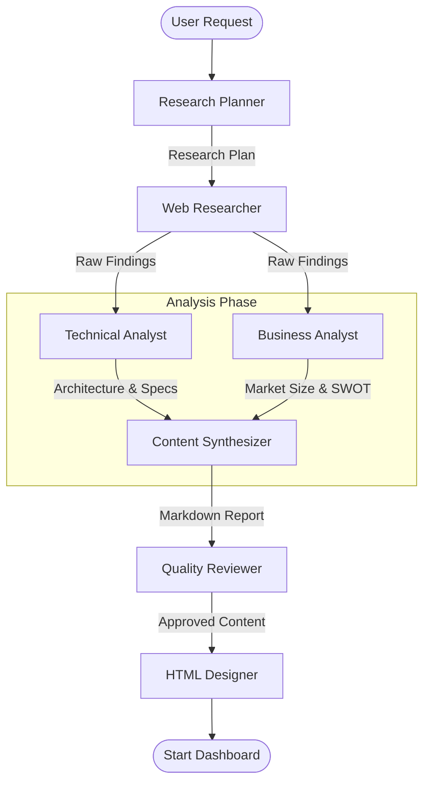

# BVA507E - Agentic Research Studio
### Autonomous Multi-Agent Business Intelligence System

**Course**: BVA507E - Business Analytics for Managers  
**Project**: Strategic AI Research Agent Swarm  
**Models**: GPT-5-mini, GPT-4o  
**Version**: 2.0 (Dockerized)

---

## 1. Project Overview

The **Agentic Research Studio** is an advanced autonomous system designed to emulate a top-tier consultancy firm (e.g., McKinsey, BCG). Instead of human analysts, it employs a swarm of **AI Agents** to perform deep market research, technical due diligence, and strategic synthesis.

Using **LangGraph** for orchestration and **Docker** for deployment, the system takes a high-level topic (e.g., "Impact of Quantum Computing on Banking") and autonomously produces a **World-Class Executive Dashboard** complete with interactive charts, SWOT analysis, and cited technical references.

### Key Capabilities
*   **Deep Recursive Research**: Agents don't just search once; they analyze results, generate follow-up queries, and dig deeper.
*   **Role-Based Swarm**: Dedicated agents for Planning, Web Research, Technical Analysis, and Business Strategy.
*   **Interactive Visuals**: Generates single-page HTML applications with `Chart.js` visualizations dynamically.
*   **Academic Rigor**: Citations, methodology transparency, and structured analytical frameworks.

---

## 2. Agent Intelligence Architecture

### 2.1 The Agent Swarm (LangGraph)
The core intelligence is managed by a **StateGraph**, where a shared "Brain" (State) is passed between agents.



### 2.2 Agent Roles & Responsibilities

| Agent Role | Model | Function | Output |
| :--- | :--- | :--- | :--- |
| **Research Planner** | GPT-4o | Deconstructs topic into 5-8 research questions. Assigns tasks. | `ResearchPlan` (JSON) |
| **Web Researcher** | DuckDuckGo | Performs recursive searches (3 queries/question). Captures sources. | `List[Finding]` (Raw Data) |
| **Technical Analyst** | GPT-5-mini | Analyzes GitHub/Docs. Focuses on stack, architecture, and engineering. | `TechnicalAnalysis` (Deep Dive) |
| **Business Analyst** | GPT-5-mini | Focuses on Market Size (TAM/SAM/SOM), Competitors, and Growth. | `BusinessStrategy` (SWOT) |
| **HTML Designer** | GPT-4o | Codes the interactive dashboard with Chart.js and Tailwind. | `report.html` (Single File) |

### 2.3 Shared State (`ResearchState`)
Agents communicate by modifying a shared JSON state:
```json
{
  "topic": "Future of EVs",
  "research_plan": {
    "questions": ["What is the battery market size?", "Who are key players?"]
  },
  "web_findings": [
    { "source": "Bloomberg", "content": "..." }
  ],
  "synthesized_content": "## Analysis...",
  "html_output": "<html>...</html>"
}
```

---

## 3. Configuration & Settings

The UI controls the "Brain" parameters directly:

### Quick Search vs. Deep Search
*   **Quick Search (`depth='basic'`)**:
    *   Planner generates fewer questions (3-4).
    *   Web Researcher performs single-shot searches.
    *   Ideal for: Rapid fact-checking or news summaries.
*   **Deep Research (`depth='deep'`)**:
    *   Planner generates 8+ questions across Technical/Business/Market categories.
    *   Web Researcher uses **Recursive Query Generation** (3 variations per question).
    *   Analysts perform detailed deep-dives.
    *   Ideal for: Strategic Reports, Due Diligence, Academic Papers.

### Tone Settings
*   **Professional**: Balanced, corporate tone suitable for general business reading.
*   **Academic**: More rigorous, cited, and formal language (BVA507E Standard).

---

## 4. Technical Stack

*   **Backend**: Python 3.11, FastAPI, LangGraph, LangChain.
*   **Frontend**: Next.js 14 (App Router), Tailwind CSS, Framer Motion.
*   **AI Models**: OpenAI (GPT-4o, GPT-5-mini via API).
*   **Infrastructure**: Docker Compose (Multi-container orchestration).

### Folder Structure
```text
/
├── backend/                # Python Service (Port 8000)
│   ├── app/
│   │   ├── agents/         # Individual Agent Logic
│   │   ├── api/            # Routes (POST /research)
│   │   ├── core/           # Graph Definition & Config
│   │   └── utils/          # Helpers
│   └── Dockerfile          # Python 3.11 Environment
│
├── frontend/               # Next.js App (Port 3000)
│   ├── src/components/     # UI Components (InputArea, ThinkingIndicator)
│   └── Dockerfile          # Node.js 20 Standalone Build
│
└── docker-compose.yml      # Service Definitions
```

---

## 5. How to Run

### Prerequisites
*   Docker Desktop installed.
*   OpenAI API Key.

### Installation & Launch
1.  **Configure Environment**:
    Create `backend/.env` and add your key:
    ```bash
    OPENAI_API_KEY=sk-proj-...
    ```

2.  **Start System**:
    ```bash
    docker-compose up --build
    ```
    *   This builds both containers and creates a private network.
    *   **Frontend Reference**: `http://localhost:3000`
    *   **Backend Internal**: `http://backend:8000`

3.  **Usage**:
    1.  Go to `http://localhost:3000`.
    2.  Select **"Deep Search"** and **"Academic"** mode.
    3.  Enter a topic (e.g., "GenAI in Supply Chain").
    4.  Watch the **Terminal Logs** as agents collaborate.
    5.  Download and open `report.html`.

---

**Developed for ITU BVA507E by Oguzhan Kir.**
